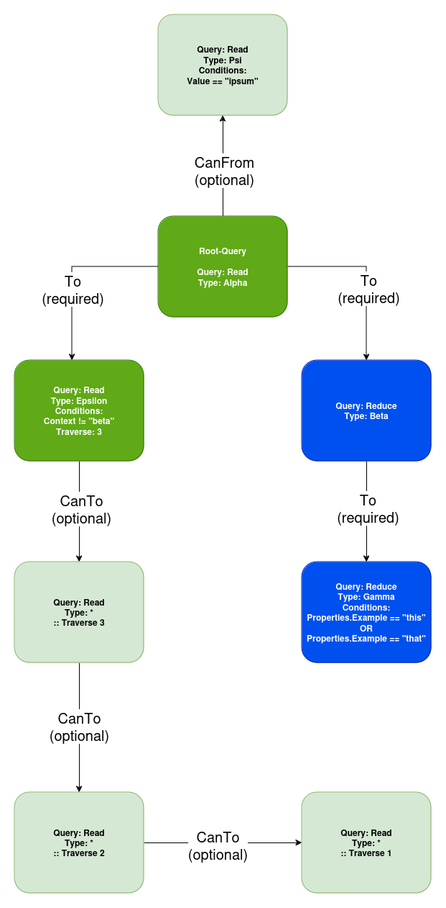

# Query Builder
[back](README.md)

## Index
* [Overview](#overview)
* [Query Methods](#query-methods)
* [Examples and Usage](#examples-and-usage)
  * [1. Simple Read Query](#1-simple-read-query)
  * [2. Simple Read Query - Multiple Types](#2-simple-read-query---multiple-types)
  * [3. Filtering by Value:](#3-filtering-by-value)
  * [4. Filtering by Context:](#4-filtering-by-context)
  * [5. Filtering by Property:](#5-filtering-by-property)
  * [6. Combining Filters:](#6-combining-filters)
  * [7. Combining filters with OR Condition](#7-combining-filters-with-or-condition)
  * [8. Simple Child Join:](#8-simple-child-join)
  * [9. Simple Parent Join:](#9-simple-parent-join)
  * [10. Simple Optional Child Join:](#10-simple-optional-child-join)
  * [11. Simple Optional Parent Join:](#11-simple-optional-parent-join)
  * [12. Zigzag Join](#12-zigzag-join)
  * [13. Filtered Join:](#13-filtered-join)
  * [14. Traversing out:](#14-traversing-out)
  * [15. Update entities](#15-update-entities)
  * [16 Delete entities](#16-delete-entities)
  * [17. Link entities](#17-link-entities)
  * [18. Unlink entities](#18-unlink-entities)
  * [19. Adjusting the result order](#19-adjusting-the-result-order)
  * [20. Complex read query example](#20-complex-read-query-example)
* [Definitions](#definitions)
  * [Supported Match Operators](#supported-match-operators)


## Overview
The GITS Query Language is a custom implementation optimized for the usage with GITS. GITS provides a Query Builder and execution method via a global accessible interface. The following document should provide an overview over the Methods available in this context and examples for various query actions. 

## Query Methods
**1. Query Construction**
* **New()**: Creates a new, empty query object.

**2. Setting Query Type**
* **Read(etype ...string)**:Sets the query type to read entities of the specified type(s).
* **Reduce(etype ...string)**: Sets the query type to reduce entities of the specified type(s) (used in joins to reduce the results).
* **Update(etype ...string)**: Sets the query type to update entities of the specified type(s). Is only supported as root query.
* **Delete(etype ...string)**: Sets the query type to delete entities of the specified type(s). Is only supported as root query.
* **Link(etype ...string)**: Sets the query type to create links between entities of the specified type(s). Is only supported as root query.
* **Unlink(etype ...string)**: Sets the query type to remove links between entities of the specified type(s). Is only supported as root query.
* **Find(etype ...string)**: Sets the query type to find entities of the specified type(s). Is used in context of "Link()" and "Unlink()"

**3. Filtering and Matching**
* **Match(alpha string, operator string, beta string)**: Adds a condition to the query. The condition can be based on entity value, context, id or properties. Multiple match queries will be assumed as "AND".
* **OrMatch(alpha string, operator string, beta string)**: Adds an OR condition to the query match definitions. 

**4. Defining Relationships**
* **To(query *Query)**: Adds a child query to the current query.
* **From(query *Query)**: Adds a parent query to the current query.
* **CanTo(query *Query)**: Adds an optional child query to the current query.
* **CanFrom(query *Query)**: Adds an optional parent query to the current query.

**5. Modifying and Sorting**
* **Set(key string, value string)**: Sets a key-value pair for updating entity value,context or properties.
* **Order(field string, direction int, mode int)**: Specifies sorting criteria for the query results. Is only supported to modify the root query. Will sort results based on root level of results.

**6. Traversing Relationships**
* **TraverseOut(depth int)**: Traverses relationships outward (children) from the current entity up to a specified depth.
* **TraverseIn(depth int)**: Traverses relationships inward (parents) up to a specified depth.

**7. Executing the Query**
* **gitsInstance.Query().Execute(query *Query)**: Executes the query and returns the results.

In the next step, we will provide practical examples to illustrate how to use these methods to construct complex queries. The query return prints will be in json format for practical reasons.

## Examples and Usage
Using the [GITS instance](INSTANCES.md) a QueryAdapter can be retrieved. This query adapter offers multiple functions in order to work with the query builder.
```go
// First we create a storage instance
gitsInstance := gits.NewInstance("test")

// Than we store the *gits.QueryAdapter for later usage
qa := gitsInstance.Query()

// The adapter offers the possibilitiy to get a query builder using
qry := qa.New() //.Read(..).Match(..)...

// The final query created with the builder can than be executed using
result := qa.Execute(qry)
```

***Note: All query examples can also be found in [examples.go](../cmd/examples/examples.go) .***

[top](#query-builder)
### 1. Simple Read Query
```go
qry := qa.New().Read("Alpha")
result := qa.Execute(qry)
```
This query reads all entities of type "Alpha". The result can include N results 

```json
{
  "Entities": [
    {
      "Type": "Alpha",
      "ID": 1,
      "Value": "Something",
      "Context": "",
      "Version": 1,
      "Properties": {},
      "ChildRelations": [],
      "ParentRelations": []
    },
    {
      "Type": "Alpha",
      "ID": 2,
      "Value": "someValue",
      "Context": "",
      "Version": 1,
      "Properties": {},
      "ChildRelations": [],
      "ParentRelations": []
    },
    {
      "Type": "Alpha",
      "ID": 3,
      "Value": "lorem",
      "Context": "",
      "Version": 1,
      "Properties": {},
      "ChildRelations": [],
      "ParentRelations": []
    }
  ],
  "Relations": null,
  "Amount": 3
}
```

### 2. Simple Read Query - Multiple Types
```go
qry := qa.New().Read("Alpha","Beta")
result := qa.Execute(qry)
```
This query reads all entities of type "Alpha" and "Beta". The result can include N results.

```json
{
  "Entities": [
    {
      "Type": "Alpha",
      "ID": 1,
      "Value": "Something",
      "Context": "",
      "Version": 1,
      "Properties": {},
      "ChildRelations": [],
      "ParentRelations": []
    },
    {
      "Type": "Alpha",
      "ID": 2,
      "Value": "someValue",
      "Context": "",
      "Version": 1,
      "Properties": {},
      "ChildRelations": [],
      "ParentRelations": []
    },
    {
      "Type": "Beta",
      "ID": 1,
      "Value": "ipsum",
      "Context": "",
      "Version": 1,
      "Properties": {},
      "ChildRelations": [],
      "ParentRelations": []
    },
    {
      "Type": "Beta",
      "ID": 2,
      "Value": "appropinquare",
      "Context": "",
      "Version": 1,
      "Properties": {},
      "ChildRelations": [],
      "ParentRelations": []
    }
  ],
  "Relations": null,
  "Amount": 4
}

```

### 3. Filtering by Value:
```go
qry := qa.New().Read("Alpha").Match("Value", "==", "someValue")
result := qa.Execute(qry)
```
This query reads all entities of type "Alpha" where the "Value" property equals "someValue". Using Match operators we are able to filter results based on our needs [List of supported matching operators](#supported-match-operators)
```json
{
  "Entities": [
    {
      "Type": "Alpha",
      "ID": 2,
      "Value": "someValue",
      "Context": "",
      "Version": 1,
      "Properties": {},
      "ChildRelations": [],
      "ParentRelations": []
    }
  ],
  "Relations": null,
  "Amount": 1
}
```

### 4. Filtering by Context:
```go
qry := qa.New().Read("Alpha").Match("Context", "==", "someContext")
result := qa.Execute(qry)
```
This query reads all entities of type "Alpha" where the "Context" property equals "someContext".  [List of supported matching operators](#supported-match-operators)
```json
{
  "Entities": [
    {
      "Type": "Alpha",
      "ID": 3,
      "Value": "lorem",
      "Context": "someContext",
      "Version": 1,
      "Properties": {},
      "ChildRelations": [],
      "ParentRelations": []
    }
  ],
  "Relations": null,
  "Amount": 1
}
```

### 5. Filtering by Property:
```go
qry := qa.New().Read("Entity").Match("Properties.MyPropertyName", "==", "propertyValue")
result := qa.Execute(qry)
```
This query reads all entities of type "Alpha" where the "MyPropertyName" property equals "propertyValue".  [List of supported matching operators](#supported-match-operators)
```json
{
  "Entities": [
    {
      "Type": "Alpha",
      "ID": 3,
      "Value": "lorem",
      "Context": "someContext",
      "Version": 1,
      "Properties": {
        "MyPropertyName": "propertyValue"
      },
      "ChildRelations": [],
      "ParentRelations": []
    },
    {
      "Type": "Alpha",
      "ID": 4,
      "Value": "another",
      "Context": "",
      "Version": 1,
      "Properties": {
        "MyPropertyName": "propertyValue"
      },
      "ChildRelations": [],
      "ParentRelations": []
    }
  ],
  "Relations": null,
  "Amount": 2
}
```

### 6. Combining Filters:
```go
qry := qa.New().Read("Entity").Match("Value", "==", "someValue").Match("Context", "==", "someContext")
result := qa.Execute(qry)
```
This query reads all entities of type "Alpha" where both the "Value" and "Context" match the specified values. Consecutive Match() statements are assumed as "AND".  [List of supported matching operators](#supported-match-operators)
```json
{
  "Entities": [
    {
      "Type": "Alpha",
      "ID": 2,
      "Value": "someValue",
      "Context": "someContext",
      "Version": 1,
      "Properties": {},
      "ChildRelations": [],
      "ParentRelations": []
    }
  ],
  "Relations": null,
  "Amount": 1
}
```

### 7. Combining filters with OR Condition
```go
qry := qa.New().Read("Alpha").Match("Context", "==", "Lorem").Match("Value", "==", "someValue").OrMatch("Context", "==", "ipsum").Match("Value", "==", "finally")
result := qa.Execute(qry)
```
This query reads all entities of type "Alpha" where either ("Context" equals "Lorem" and "Value" equals "someValueA") OR ("Context" equals "ipsum" and "Value" equals "finally"). While multiple consecutive match conditions are assumed as AND, adding an "OrMatch()" will split the previous and following into different groups. You are allowed to use as many "OrMatch" as you need. Nesting of conditions is not supported right now.  [List of supported matching operators](#supported-match-operators)
```json
{
  "Entities": [
    {
      "Type": "Alpha",
      "ID": 3,
      "Value": "someValue",
      "Context": "Lorem",
      "Version": 1,
      "Properties": {
        "MyPropertyName": "propertyValue"
      },
      "ChildRelations": [],
      "ParentRelations": []
    },
    {
      "Type": "Alpha",
      "ID": 4,
      "Value": "finally",
      "Context": "ipsum",
      "Version": 1,
      "Properties": {
        "MyPropertyName": "propertyValue"
      },
      "ChildRelations": [],
      "ParentRelations": []
    }
  ],
  "Relations": null,
  "Amount": 2
}
```

### 8. Simple Child Join:
```go
qry := qa.New().Read("Alpha").To(qa.New().Read("Beta"))
result := qa.Execute(qry)
```
This query reads all entities of type "Alpha" and their child linked "Beta" entities. "To" is a "required" call which means there must be linked entities
```json
{
  "Entities": [
    {
      "Type": "Alpha",
      "ID": 2,
      "Value": "lorem",
      "Context": "",
      "Version": 1,
      "Properties": {},
      "ChildRelations": [
        {
          "Context": "",
          "Properties": null,
          "Target": {
            "Type": "Beta",
            "ID": 3,
            "Value": "ipsum",
            "Context": "",
            "Version": 1,
            "Properties": {},
            "ChildRelations": [],
            "ParentRelations": []
          },
          "SourceType": "",
          "SourceID": 0,
          "TargetType": "",
          "TargetID": 0,
          "Version": 0
        }
      ],
      "ParentRelations": []
    },
    {
      "Type": "Alpha",
      "ID": 1,
      "Value": "some",
      "Context": "",
      "Version": 1,
      "Properties": {},
      "ChildRelations": [
        {
          "Context": "",
          "Properties": null,
          "Target": {
            "Type": "Beta",
            "ID": 1,
            "Value": "thing",
            "Context": "",
            "Version": 1,
            "Properties": {},
            "ChildRelations": [],
            "ParentRelations": []
          },
          "SourceType": "",
          "SourceID": 0,
          "TargetType": "",
          "TargetID": 0,
          "Version": 0
        },
        {
          "Context": "",
          "Properties": null,
          "Target": {
            "Type": "Beta",
            "ID": 2,
            "Value": "else",
            "Context": "",
            "Version": 1,
            "Properties": {},
            "ChildRelations": [],
            "ParentRelations": []
          },
          "SourceType": "",
          "SourceID": 0,
          "TargetType": "",
          "TargetID": 0,
          "Version": 0
        }
      ],
      "ParentRelations": []
    }
  ],
  "Relations": null,
  "Amount": 2
}
```

### 9. Simple Parent Join:
```go
qry := qa.New().Read("Alpha").From(qa.New().Read("Beta"))
result := qa.Execute(qry)
```
This query reads all entities of type "Alpha" and their parent linked "Beta" entities. "From" is a "required" call which means there must be linked entities.
```json
{
  "Entities": [
    {
      "Type": "Alpha",
      "ID": 1,
      "Value": "some",
      "Context": "",
      "Version": 1,
      "Properties": {},
      "ChildRelations": [],
      "ParentRelations": [
        {
          "Context": "",
          "Properties": null,
          "Target": {
            "Type": "Beta",
            "ID": 1,
            "Value": "thing",
            "Context": "",
            "Version": 1,
            "Properties": {},
            "ChildRelations": [],
            "ParentRelations": []
          },
          "SourceType": "",
          "SourceID": 0,
          "TargetType": "",
          "TargetID": 0,
          "Version": 0
        },
        {
          "Context": "",
          "Properties": null,
          "Target": {
            "Type": "Beta",
            "ID": 2,
            "Value": "else",
            "Context": "",
            "Version": 1,
            "Properties": {},
            "ChildRelations": [],
            "ParentRelations": []
          },
          "SourceType": "",
          "SourceID": 0,
          "TargetType": "",
          "TargetID": 0,
          "Version": 0
        }
      ]
    },
    {
      "Type": "Alpha",
      "ID": 2,
      "Value": "lorem",
      "Context": "",
      "Version": 1,
      "Properties": {},
      "ChildRelations": [],
      "ParentRelations": [
        {
          "Context": "",
          "Properties": null,
          "Target": {
            "Type": "Beta",
            "ID": 3,
            "Value": "ipsum",
            "Context": "",
            "Version": 1,
            "Properties": {},
            "ChildRelations": [],
            "ParentRelations": []
          },
          "SourceType": "",
          "SourceID": 0,
          "TargetType": "",
          "TargetID": 0,
          "Version": 0
        }
      ]
    }
  ],
  "Relations": null,
  "Amount": 2
}
```

### 10. Simple Optional Child Join:
```go
qry := qa.New().Read("Alpha").CanTo(qa.New().Read("Beta"))
result := qa.Execute(qry)
```
This query reads all entities of type "Alpha" and their, if existent, child linked "Beta" entities. "CanTo" is a "optional" call which means there can be linked entities but its not required.
```json
{
  "Entities": [
    {
      "Type": "Alpha",
      "ID": 1,
      "Value": "some",
      "Context": "",
      "Version": 1,
      "Properties": {},
      "ChildRelations": [
        {
          "Context": "",
          "Properties": null,
          "Target": {
            "Type": "Beta",
            "ID": 1,
            "Value": "thing",
            "Context": "",
            "Version": 1,
            "Properties": {},
            "ChildRelations": [],
            "ParentRelations": []
          },
          "SourceType": "",
          "SourceID": 0,
          "TargetType": "",
          "TargetID": 0,
          "Version": 0
        },
        {
          "Context": "",
          "Properties": null,
          "Target": {
            "Type": "Beta",
            "ID": 2,
            "Value": "else",
            "Context": "",
            "Version": 1,
            "Properties": {},
            "ChildRelations": [],
            "ParentRelations": []
          },
          "SourceType": "",
          "SourceID": 0,
          "TargetType": "",
          "TargetID": 0,
          "Version": 0
        }
      ],
      "ParentRelations": []
    },
    {
      "Type": "Alpha",
      "ID": 2,
      "Value": "Well",
      "Context": "",
      "Version": 1,
      "Properties": {},
      "ChildRelations": [],
      "ParentRelations": []
    },
    {
      "Type": "Alpha",
      "ID": 3,
      "Value": "Done",
      "Context": "",
      "Version": 1,
      "Properties": {},
      "ChildRelations": [],
      "ParentRelations": []
    }
  ],
  "Relations": null,
  "Amount": 3
}
```

### 11. Simple Optional Parent Join:
```go
qry := qa.New().Read("Alpha").CanFrom(qa.New().Read("Beta"))
result := qa.Execute(qry)
```
This query reads all entities of type "Alpha" and their, if existent, parent linked "Beta" entities. "CanFrom" is a "optional" call which means there can be linked entities but its not required.
```json
{
  "Entities": [
    {
      "Type": "Alpha",
      "ID": 1,
      "Value": "some",
      "Context": "",
      "Version": 1,
      "Properties": {},
      "ChildRelations": [],
      "ParentRelations": [
        {
          "Context": "",
          "Properties": null,
          "Target": {
            "Type": "Beta",
            "ID": 1,
            "Value": "thing",
            "Context": "",
            "Version": 1,
            "Properties": {},
            "ChildRelations": [],
            "ParentRelations": []
          },
          "SourceType": "",
          "SourceID": 0,
          "TargetType": "",
          "TargetID": 0,
          "Version": 0
        },
        {
          "Context": "",
          "Properties": null,
          "Target": {
            "Type": "Beta",
            "ID": 2,
            "Value": "else",
            "Context": "",
            "Version": 1,
            "Properties": {},
            "ChildRelations": [],
            "ParentRelations": []
          },
          "SourceType": "",
          "SourceID": 0,
          "TargetType": "",
          "TargetID": 0,
          "Version": 0
        }
      ]
    },
    {
      "Type": "Alpha",
      "ID": 2,
      "Value": "Well",
      "Context": "",
      "Version": 1,
      "Properties": {},
      "ChildRelations": [],
      "ParentRelations": []
    },
    {
      "Type": "Alpha",
      "ID": 3,
      "Value": "Done",
      "Context": "",
      "Version": 1,
      "Properties": {},
      "ChildRelations": [],
      "ParentRelations": []
    }
  ],
  "Relations": null,
  "Amount": 3
}
```

### 12. Zigzag Join
```go
qry := qa.New().Read("Alpha").To(qa.New().Read("Beta").From(qa.New().Read("Gamma")))
result := qa.Execute(qry)
```
This query will read all entities of type "Alpha" and their child linked "Beta" which than are linked to "Gamma". This should showcase how "joins" can be nested.
```json
{
  "Entities": [
    {
      "Type": "Alpha",
      "ID": 1,
      "Value": "some",
      "Context": "",
      "Version": 1,
      "Properties": {},
      "ChildRelations": [
        {
          "Context": "",
          "Properties": null,
          "Target": {
            "Type": "Beta",
            "ID": 1,
            "Value": "thing",
            "Context": "",
            "Version": 1,
            "Properties": {},
            "ChildRelations": [],
            "ParentRelations": [
              {
                "Context": "",
                "Properties": null,
                "Target": {
                  "Type": "Gamma",
                  "ID": 1,
                  "Value": "thatsit",
                  "Context": "",
                  "Version": 1,
                  "Properties": {},
                  "ChildRelations": [],
                  "ParentRelations": []
                },
                "SourceType": "",
                "SourceID": 0,
                "TargetType": "",
                "TargetID": 0,
                "Version": 0
              }
            ]
          },
          "SourceType": "",
          "SourceID": 0,
          "TargetType": "",
          "TargetID": 0,
          "Version": 0
        }
      ],
      "ParentRelations": []
    }
  ],
  "Relations": null,
  "Amount": 1
}
```

### 13. Filtered Join:
```go
qry := qa.New().Read("Alpha").To(qa.New().Read("Beta").Match("Value", "==", "someValue"))
result := qa.Execute(qry)
```
This query reads all entities of type "Alpha" and their linked "Beta" entities where the "Beta" entities have a "Value" property equal to "someValue".
```json
{
  "Entities": [
    {
      "Type": "Alpha",
      "ID": 1,
      "Value": "some",
      "Context": "",
      "Version": 1,
      "Properties": {},
      "ChildRelations": [
        {
          "Context": "",
          "Properties": null,
          "Target": {
            "Type": "Beta",
            "ID": 1,
            "Value": "someValue",
            "Context": "",
            "Version": 1,
            "Properties": {},
            "ChildRelations": [],
            "ParentRelations": []
          },
          "SourceType": "",
          "SourceID": 0,
          "TargetType": "",
          "TargetID": 0,
          "Version": 0
        }
      ],
      "ParentRelations": []
    }
  ],
  "Relations": null,
  "Amount": 1
}
```

### 14. Traversing out:
```go
qry := qa.New().Read("Alpha").TraverseOut(3)
result := qa.Execute(qry)
```
This query reads all entities of type "Entity", than it will traverse out (follow relations towards children) up to a depth of 3. Can be especially useful in abstract structures where properties are handled as child entities or abstracts without static structural definitions. Traverse is supported towards children "TraverseOut" and parents "TraverseIn". 
```json
{
  "Entities": [
    {
      "Type": "Alpha",
      "ID": 1,
      "Value": "never",
      "Context": "",
      "Version": 1,
      "Properties": {},
      "ChildRelations": [
        {
          "Context": "",
          "Properties": null,
          "Target": {
            "Type": "Osa",
            "ID": 1,
            "Value": "down",
            "Context": "",
            "Version": 1,
            "Properties": {},
            "ChildRelations": null,
            "ParentRelations": null
          },
          "SourceType": "",
          "SourceID": 0,
          "TargetType": "",
          "TargetID": 0,
          "Version": 0
        },
        {
          "Context": "",
          "Properties": null,
          "Target": {
            "Type": "Gamma",
            "ID": 1,
            "Value": "gonne",
            "Context": "",
            "Version": 1,
            "Properties": {},
            "ChildRelations": [
              {
                "Context": "",
                "Properties": null,
                "Target": {
                  "Type": "Epsilon",
                  "ID": 1,
                  "Value": "give",
                  "Context": "",
                  "Version": 1,
                  "Properties": {},
                  "ChildRelations": [
                    {
                      "Context": "",
                      "Properties": null,
                      "Target": {
                        "Type": "Psi",
                        "ID": 1,
                        "Value": "you",
                        "Context": "",
                        "Version": 1,
                        "Properties": {},
                        "ChildRelations": null,
                        "ParentRelations": null
                      },
                      "SourceType": "",
                      "SourceID": 0,
                      "TargetType": "",
                      "TargetID": 0,
                      "Version": 0
                    },
                    {
                      "Context": "",
                      "Properties": null,
                      "Target": {
                        "Type": "Poi",
                        "ID": 1,
                        "Value": "up",
                        "Context": "",
                        "Version": 1,
                        "Properties": {},
                        "ChildRelations": null,
                        "ParentRelations": null
                      },
                      "SourceType": "",
                      "SourceID": 0,
                      "TargetType": "",
                      "TargetID": 0,
                      "Version": 0
                    }
                  ],
                  "ParentRelations": null
                },
                "SourceType": "",
                "SourceID": 0,
                "TargetType": "",
                "TargetID": 0,
                "Version": 0
              }
            ],
            "ParentRelations": null
          },
          "SourceType": "",
          "SourceID": 0,
          "TargetType": "",
          "TargetID": 0,
          "Version": 0
        },
        {
          "Context": "",
          "Properties": null,
          "Target": {
            "Type": "Beta",
            "ID": 1,
            "Value": "never",
            "Context": "",
            "Version": 1,
            "Properties": {},
            "ChildRelations": [
              {
                "Context": "",
                "Properties": null,
                "Target": {
                  "Type": "Foo",
                  "ID": 1,
                  "Value": "gonne",
                  "Context": "",
                  "Version": 1,
                  "Properties": {},
                  "ChildRelations": null,
                  "ParentRelations": null
                },
                "SourceType": "",
                "SourceID": 0,
                "TargetType": "",
                "TargetID": 0,
                "Version": 0
              },
              {
                "Context": "",
                "Properties": null,
                "Target": {
                  "Type": "Bar",
                  "ID": 1,
                  "Value": "let",
                  "Context": "",
                  "Version": 1,
                  "Properties": {},
                  "ChildRelations": null,
                  "ParentRelations": null
                },
                "SourceType": "",
                "SourceID": 0,
                "TargetType": "",
                "TargetID": 0,
                "Version": 0
              }
            ],
            "ParentRelations": null
          },
          "SourceType": "",
          "SourceID": 0,
          "TargetType": "",
          "TargetID": 0,
          "Version": 0
        },
        {
          "Context": "",
          "Properties": null,
          "Target": {
            "Type": "Kato",
            "ID": 1,
            "Value": "you",
            "Context": "",
            "Version": 1,
            "Properties": {},
            "ChildRelations": null,
            "ParentRelations": null
          },
          "SourceType": "",
          "SourceID": 0,
          "TargetType": "",
          "TargetID": 0,
          "Version": 0
        }
      ],
      "ParentRelations": []
    }
  ],
  "Relations": null,
  "Amount": 1
}
```

### 15. Update entities
```go
qry := qa.New().Update("Alpha").Match("Value","==","old").Set("Value", "Lorem").Set("Context", "Ipsum").Set("Properties.dolor","appropinquare")
result := qa.Execute(qry)
```
This query will update all entities of type "Alpha" which match ("Value" equals "old"). It will update "Context" to "Ipsum", "Value" to "Lorem" and the Property "dolor" to "appropinquare". This can affect a single or multiple entities, based on your filters. Update query must always be a root level query. Update can be used with "(Can)To" and "(Can)From" in order to reduce/filter the affected datasets. It is recommended to use "Reduce()" instead of "Read()" in such subqueries to minimize the amount of allocated memory.
```json
// an update query will not return any entity datasets. The amount indicates 
// the amount of updated datasets 
{
  "Entities": null,
  "Relations": null,
  "Amount": 1
}
```

### 16 Delete entities
```go
qry := qa.New().Delete("Alpha").Match("Context", "==", "deleteme")
result := qa.Execute(qry)
```
This query will delete all entities of type "Alpha" which match ("Context" equals "deleteme"). This can affect a single or multiple entities, based on your filters. Delete query must always be a root level query. Delete can be used with "(Can)To" and "(Can)From" in order to reduce/filter the affected datasets. It is recommended to use "Reduce()" instead of "Read()" in joins to minimize the amount of allocated memory.
```json
// a delete query will not return any entity datasets. The amount indicates 
// the amount of deleted datasets 
{
  "Entities": null,
  "Relations": null,
  "Amount": 2
}
```

### 17. Link entities
```go
qry := qa.New().Link("Alpha").Match("Value", "==", "psi").To(
    qa.New().Find("Beta").Match("Value", "==", "omega"),
)
qa.Execute(qry)
```
This query will find all entities of type "Alpha" which match "Value" equals "psi" and link (create a directed relation) the result list to result of the join which matches entities of type "Beta" with "Value" equals "omega". This means it creates a Relation from each Source to each Target found. As you can see the "To" definition is used in this context to define the direction of the "Link" action, in this case towards children. Also we use "Find" instead of "Read or Reduce" in order to provide the necessary dataset address list to our link function. You can use this to link any amount of entities. Link query must always be a root level query. Since Link uses the target list of "To()" and "From()" results to determine where the links should be created, it is not possible to use those as pure filter right now.  
```json
// a link query will not return any entity datasets. The amount indicates 
// the amount of source datasets on root level that have been linked  
{
  "Entities": null,
  "Relations": null,
  "Amount": 1
}
```


### 18. Unlink entities
```go
qry := qa.New().Unlink("Alpha").Match("Value", "==", "psi").To(
    qa.New().Find("Beta").Match("Context", "==", "omega"),
)
qa.Execute(qry)
```
This query will find all entities of type "Alpha" which match "Value" equals "psi" and unlink (remove a directed relation) the result list to result of the join which matches entities of type "Beta" with "Context" equals "omega". As you can see the "To" definition is used in this context to define the direction of the "Unlink" action, in this case towards children. Also we use "Find" instead of "Read or Reduce" in order to provide the necessary dataset address list to our unlink function. You can use this to unlink any amount of entities. Unlink query must always be a root level query. Since Link uses the target list of "To()" and "From()" results to determine where the links should be deleted, it is not possible to use those as pure filter right now.
```json
// an unlink query will not return any entity datasets. The amount indicates 
// the amount of target datasets that have been unlinked  
{
  "Entities": null,
  "Relations": null,
  "Amount": 2
}
```


### 19. Adjusting the result order
```go
qry := qa.New().Read("Alpha").Order("Properties.Psi", query.ORDER_DIRECTION_ASC, query.ODER_MODE_NUM)
result := qa.Execute(qry)
```
This query will find all entities of type "Alpha". Before returning the data, it will resort the order of the root level results by the field "Properties.Psi" direction "ASC" (ascending) in mode "ORDER_MODE_NUMERIC". Order can only be applied on root level queries and will sort results only on root level results.
```json
{
  "Entities": [
    {
      "Type": "Alpha",
      "ID": 4,
      "Value": "never",
      "Context": "",
      "Version": 1,
      "Properties": {
        "Psi": "1"
      },
      "ChildRelations": [],
      "ParentRelations": []
    },
    {
      "Type": "Alpha",
      "ID": 1,
      "Value": "gonne",
      "Context": "",
      "Version": 1,
      "Properties": {
        "Psi": "2"
      },
      "ChildRelations": [],
      "ParentRelations": []
    },
    {
      "Type": "Alpha",
      "ID": 3,
      "Value": "give",
      "Context": "",
      "Version": 1,
      "Properties": {
        "Psi": "3"
      },
      "ChildRelations": [],
      "ParentRelations": []
    },
    {
      "Type": "Alpha",
      "ID": 5,
      "Value": "you",
      "Context": "",
      "Version": 1,
      "Properties": {
        "Psi": "4"
      },
      "ChildRelations": [],
      "ParentRelations": []
    },
    {
      "Type": "Alpha",
      "ID": 2,
      "Value": "up",
      "Context": "",
      "Version": 1,
      "Properties": {
        "Psi": "5"
      },
      "ChildRelations": [],
      "ParentRelations": []
    }
  ],
  "Relations": null,
  "Amount": 5
}
```


### 20. Complex read query example
```go
qry := qa.New().Read("Alpha").To(
  qa.New().Reduce("Beta").To(
    qa.New().Reduce("Gamma").Match("Properties.Example", "==", "this").OrMatch("Properties.Example", "==", "that"),
  ),
).To(
    qa.New().Read("Epsilon").Match("Context", "!=", "beta").TraverseOut(3),
).CanFrom(
    qa.New().Read("Psi").Match("Value", "==", "ipsum"),
)
result := qa.Execute(qry)
```
This is a rather complex query showcasing some of the capabilities combined. The following visualisation should showcase the queries final structure, while at the same time show the possible result structure. Results will always be starting at the root query. The dark green queries will deliver a guaranteed result. Light green queries are optional and therefor might or might not be existent in a result. The blue queries are just modifying the results and will not be included in the results.

```json
{
  "Entities": [
    {
      "Type": "Alpha",
      "ID": 1,
      "Value": "could",
      "Context": "",
      "Version": 1,
      "Properties": {},
      "ChildRelations": [
        {
          "Context": "",
          "Properties": null,
          "Target": {
            "Type": "Epsilon",
            "ID": 1,
            "Value": "never",
            "Context": "notbeta",
            "Version": 1,
            "Properties": {},
            "ChildRelations": [
              {
                "Context": "",
                "Properties": null,
                "Target": {
                  "Type": "Gamma",
                  "ID": 7,
                  "Value": "let you down",
                  "Context": "",
                  "Version": 1,
                  "Properties": {
                    "Example": "that"
                  },
                  "ChildRelations": null,
                  "ParentRelations": null
                },
                "SourceType": "",
                "SourceID": 0,
                "TargetType": "",
                "TargetID": 0,
                "Version": 0
              },
              {
                "Context": "",
                "Properties": null,
                "Target": {
                  "Type": "Gamma",
                  "ID": 2,
                  "Value": "gonne",
                  "Context": "",
                  "Version": 1,
                  "Properties": {
                    "Example": "that"
                  },
                  "ChildRelations": [
                    {
                      "Context": "",
                      "Properties": null,
                      "Target": {
                        "Type": "Gamma",
                        "ID": 3,
                        "Value": "give",
                        "Context": "",
                        "Version": 1,
                        "Properties": {
                          "Example": "that"
                        },
                        "ChildRelations": [
                          {
                            "Context": "",
                            "Properties": null,
                            "Target": {
                              "Type": "Gamma",
                              "ID": 4,
                              "Value": "you",
                              "Context": "",
                              "Version": 1,
                              "Properties": {
                                "Example": "that"
                              },
                              "ChildRelations": null,
                              "ParentRelations": null
                            },
                            "SourceType": "",
                            "SourceID": 0,
                            "TargetType": "",
                            "TargetID": 0,
                            "Version": 0
                          },
                          {
                            "Context": "",
                            "Properties": null,
                            "Target": {
                              "Type": "Gamma",
                              "ID": 5,
                              "Value": "up",
                              "Context": "",
                              "Version": 1,
                              "Properties": {
                                "Example": "that"
                              },
                              "ChildRelations": null,
                              "ParentRelations": null
                            },
                            "SourceType": "",
                            "SourceID": 0,
                            "TargetType": "",
                            "TargetID": 0,
                            "Version": 0
                          }
                        ],
                        "ParentRelations": null
                      },
                      "SourceType": "",
                      "SourceID": 0,
                      "TargetType": "",
                      "TargetID": 0,
                      "Version": 0
                    }
                  ],
                  "ParentRelations": null
                },
                "SourceType": "",
                "SourceID": 0,
                "TargetType": "",
                "TargetID": 0,
                "Version": 0
              },
              {
                "Context": "",
                "Properties": null,
                "Target": {
                  "Type": "Gamma",
                  "ID": 6,
                  "Value": "never gonne",
                  "Context": "",
                  "Version": 1,
                  "Properties": {
                    "Example": "that"
                  },
                  "ChildRelations": null,
                  "ParentRelations": null
                },
                "SourceType": "",
                "SourceID": 0,
                "TargetType": "",
                "TargetID": 0,
                "Version": 0
              }
            ],
            "ParentRelations": []
          },
          "SourceType": "",
          "SourceID": 0,
          "TargetType": "",
          "TargetID": 0,
          "Version": 0
        }
      ],
      "ParentRelations": [
        {
          "Context": "",
          "Properties": null,
          "Target": {
            "Type": "Psi",
            "ID": 1,
            "Value": "ipsum",
            "Context": "",
            "Version": 1,
            "Properties": {},
            "ChildRelations": [],
            "ParentRelations": []
          },
          "SourceType": "",
          "SourceID": 0,
          "TargetType": "",
          "TargetID": 0,
          "Version": 0
        }
      ]
    },
    {
      "Type": "Alpha",
      "ID": 2,
      "Value": "could",
      "Context": "",
      "Version": 1,
      "Properties": {},
      "ChildRelations": [
        {
          "Context": "",
          "Properties": null,
          "Target": {
            "Type": "Epsilon",
            "ID": 2,
            "Value": "never",
            "Context": "notbeta",
            "Version": 1,
            "Properties": {},
            "ChildRelations": [],
            "ParentRelations": []
          },
          "SourceType": "",
          "SourceID": 0,
          "TargetType": "",
          "TargetID": 0,
          "Version": 0
        }
      ],
      "ParentRelations": []
    }
  ],
  "Relations": null,
  "Amount": 2
}
```

[top](#query-builder)
## Definitions
### Supported Match Operators
The following operators are supported in terms of matching actions.

| Operator | Description                      | Alpha Cast                      | Beta Cast |
|----------|----------------------------------|---------------------------------|-----------|
| ==       | alpha equals beta                |                                 |           |
| !=       | alpha does not equal beta        |                                 |           |
| prefix   | beta is prefix of alpha          |                                 |           |
| suffix   | beta is suffix of alpha          |                                 |           |
| contain  | alpha contains beta              |                                 |           |
| >        | alpha is greater than beta       | int                             | int       |
| >=       | alpha is grater or equal to beta | int                             | int       |
| <        | alpha is lower than beta         | int                             | int       |
| <=       | alpha is lower or equal to beta  | int                             | int       |
| in       | if any alpha is equal to beta    | alpha is split by "," delimiter |           |

[top](#query-builder) - 
[Documentation Overview](README.md)